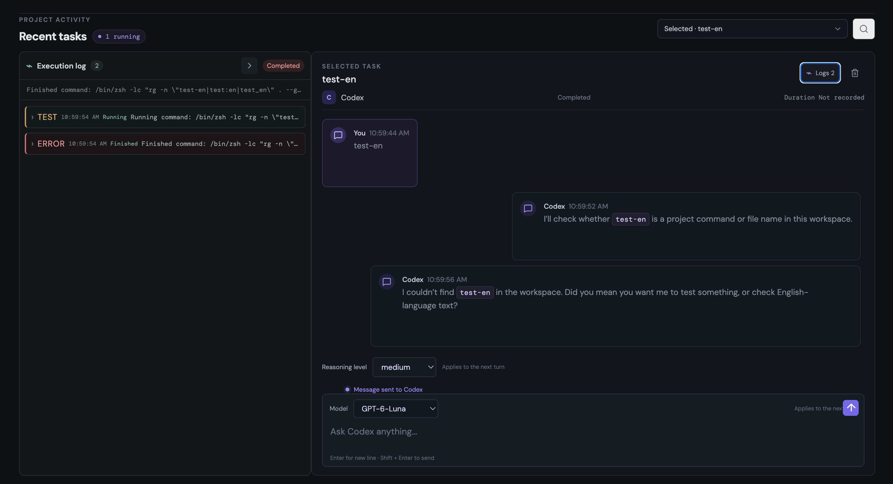

# Relay

[English](README.md) · [简体中文](README.zh-CN.md)

Relay lets you continue coding-agent work on your Mac from any browser. This
repository contains the open-source local Agent and browser UI. The hosted
Relay Cloud control plane is maintained separately and is not included in this
source distribution.

## Preview



## Repository map

```text
apps/
  web/             Current local-first browser product
packages/
  agent/           Open-source Relay Agent for macOS
  protocol/        Open protocol types, versioning and client SDKs
  shared/          Shared domain types and utilities
deploy/
  launchd/         macOS private LaunchAgent installer and guide
  homebrew/        local Homebrew formula installer and service guide
docs/
  architecture.md  Product, trust boundary and rollout design
```

Read [the architecture document](docs/architecture.md) before changing the
Agent trust boundary.

## Security model

Relay starts privileged coding-agent work. By default it binds only to
`127.0.0.1`. If you expose it beyond the local computer, put it behind HTTPS
and configure `RELAY_AUTH_TOKEN`. Automatic approval is opt-in; check the
approval setting and review the activity recorded in each session.

## Run locally

Relay's local Agent currently targets macOS. Install Node.js 22 or newer and
the Codex CLI, then sign in with `codex login` in a local terminal. Relay uses
that existing CLI session and does not store your Codex credentials.

```sh
cp .env.example .env
npm ci
npm run dev:backend
```

In a second terminal, run `npm run dev` and open `http://localhost:5173`.
On first launch, choose a local Git repository in the Relay UI.

## Development

```sh
npm run check
npm run build
```

Relay state is stored outside the target repository by default. Codex retains
ownership of its own thread history.

## Install as a macOS service

Requirements: macOS, Homebrew, and the Codex CLI signed in with `codex login`.

After the `bobtthp/homebrew-relay` tap and first GitHub Release are published,
install and start Relay with:

```sh
brew install bobtthp/relay/relay
brew services start bobtthp/relay/relay
```

Open `http://127.0.0.1:3000`. Manage the background service with:

```sh
brew services stop bobtthp/relay/relay
brew services restart bobtthp/relay/relay
brew services list
```

To uninstall Relay while keeping its local task data:

```sh
brew services stop bobtthp/relay/relay
brew uninstall bobtthp/relay/relay
```

The public tap is not published yet, so these commands will work after the
tap and first release are available. Maintainers installing from a local
checkout can use the [local Homebrew guide](deploy/homebrew/README.md). See
the [LaunchAgent guide](deploy/launchd/README.md) for the alternative setup.

## Status

Implemented:

- Local Codex discovery and session resume, streamed messages, task interruption,
  and a cross-task activity feed.
- Session timelines that group consecutive execution progress into one card and
  follow new output automatically, keeping the latest response in view.
- Per-task model and reasoning selections saved by the Agent and restored when
  the task is opened from another device connected to that Agent.
- Optional completion sounds with three styles, volume control, and preview.
- Responsive browser UI with a mobile navigation drawer and layouts for narrow
  screens.
- Explicit command, file-change, and permission approvals; MCP forms and URL
  confirmations; and Codex user-input prompts.
- Optional automatic approval, disabled by default and stored by the Agent so
  connected devices share the setting. When enabled, it accepts command requests,
  file changes only when a reviewable diff is available, and permissions limited
  to the current turn. MCP URLs, forms, and Codex questions still need manual
  handling. Relay never opens MCP URLs automatically, and unsupported form
  schemas can only be declined.
- Local task cache and loopback-only macOS service installers: LaunchAgent under
  `deploy/launchd/` and Homebrew formula/service under `deploy/homebrew/`.

Planned: extraction of the local Relay Agent, machine pairing, a hosted relay
control plane, SSH machine registration, Claude provider, and encrypted
credential storage.

## License

[MIT](LICENSE)
