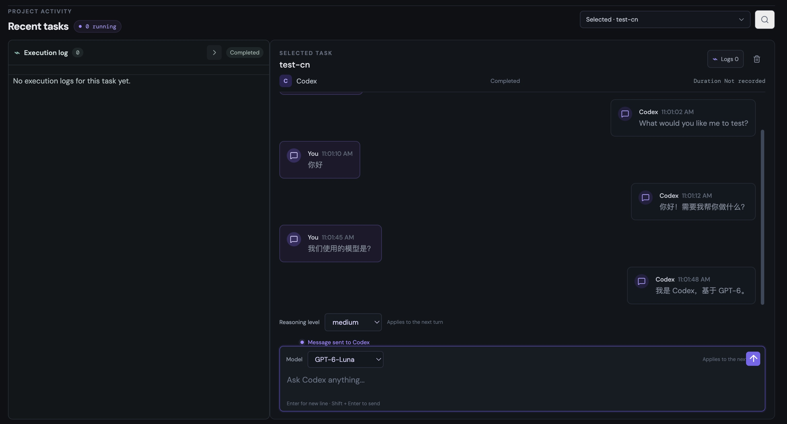

# Relay

[English](README.md) · [简体中文](README.zh-CN.md)

Relay 让你通过浏览器继续在 Mac 上使用编程 Agent。当前仓库包含本地开源 Agent
和浏览器页面；托管版 Relay Cloud 控制平面单独维护，不包含在此源码发布中。

## 界面预览



## 仓库结构

```text
apps/
  web/             当前的本地优先浏览器产品
packages/
  agent/           面向 macOS 的开源 Relay Agent
  protocol/        开放协议类型、版本管理和客户端 SDK
  shared/          共享领域类型和工具
deploy/
  launchd/         macOS LaunchAgent 安装脚本和指南
  homebrew/        本地 Homebrew Formula 安装脚本和服务指南
docs/
  architecture.md  产品、信任边界和发布计划
```

更改 Agent 信任边界前，请先阅读[架构文档](docs/architecture.md)。

## 安全模型

Relay 可以启动会读取和修改本地代码仓库的编程 Agent。默认情况下，同一局域网内的
设备可以访问服务，并需要输入访问令牌；令牌保存在 `~/.relay-web/auth-token`。
请只在可信局域网中使用，绝不要将 3000 端口暴露到公网或配置路由器端口转发。
自动批准为可选功能，默认关闭；开启后请检查设置，并查看各会话中记录的活动。

## 本地运行

本地 Relay Agent 目前面向 macOS。请安装 Node.js 22 或更新版本和 Codex CLI，
然后在本地终端运行 `codex login` 完成登录。Relay 使用现有的 CLI 登录状态，
不会保存 Codex 凭据。

```sh
cp .env.example .env
npm ci
npm run dev:all
```

这个命令会同时启动前后端；按 Ctrl+C 会一起停止。前端地址是
`http://localhost:5173`。首次打开时，在 Relay 界面中选择一个本地 Git 仓库。
浏览器要求访问令牌时，在终端运行 `cat ~/.relay-web/auth-token` 查看。

## 开发

```sh
npm run check
npm run build
```

Relay 状态默认保存在目标仓库之外。Codex 仍负责管理自己的会话历史。

## 安装为 macOS 服务

需要 macOS、Homebrew 和已登录的 Codex CLI。请先在终端运行 `codex login`。
发布流程将为受支持的 Mac 提供预编译 bottle，正常安装可直接下载 Relay，无需在本机
构建。若从源码安装，或当前 macOS/架构没有对应 bottle，则需要兼容的 Command Line
Tools。

首个 GitHub Release 发布后，先将源码仓库添加为 tap，再安装并启动服务：

```sh
brew tap bobtthp/relay https://github.com/bobtthp/relay.git
brew install bobtthp/relay/relay
brew services start bobtthp/relay/relay
```

安装后，在 Mac 上打开 `http://127.0.0.1:3000`，或在同一可信局域网的设备上打开
`http://<Mac局域网IP>:3000`。按安装提示输入访问令牌，也可以运行
`cat ~/.relay-web/auth-token` 再次查看。不要将 3000 端口暴露到公网或配置路由器端口转发。
使用以下命令管理后台服务：

```sh
brew services stop bobtthp/relay/relay
brew services restart bobtthp/relay/relay
brew services list
```

卸载 Relay 但保留本地任务数据：

```sh
brew services stop bobtthp/relay/relay
brew uninstall bobtthp/relay/relay
```

源码仓库本身托管 tap 公式。维护者从本地源码安装可参考 [Homebrew 本地安装指南](deploy/homebrew/README.md)；
另一种安装方式见 [LaunchAgent 指南](deploy/launchd/README.md)，它使用本机已有的
Node.js，不需要 Homebrew 来安装或管理 Relay。

## 使用手机或 iPad 远程操作

Relay 页面适配手机和 iPad 的 Safari。Relay 和 Codex CLI 仍在 Mac 上运行，
手机或 iPad 连接这台 Mac 后即可查看任务并发送指令。

如需私密远程访问，请在 Mac 和移动设备上安装并登录 Tailscale，再使用
Tailscale Serve 通过 HTTPS 访问 Relay，并在 Relay 页面输入访问令牌。
通过 tailnet ACL 限制可访问成员；不要将 3000 端口暴露到公网或配置路由器端口转发。详见
[私密远程访问指南](deploy/launchd/README.md#private-remote-access)。

## 自定义 Relay

点击页面右上角的设置按钮，可以调整阅读字号和界面语言。你也可以开启任务
完成提示音，在清脆、铃声和电子音之间选择，调节音量并试听。自动批准为可选
功能，默认关闭；开启前请先阅读设置中的说明。

## 状态

已实现：

- 本地 Codex 会话发现与恢复、流式消息、任务中断和跨任务活动流。
- 会话时间线会将连续的执行进度合并到同一张卡片，并在新内容到达时自动滚动，
  让最新回复保持在视野中。
- 每个任务的模型和推理强度由 Agent 保存；其他连接到该 Agent 的设备打开任务时，
  会恢复对应设置。
- 可选的任务完成提示音，支持三种音效、音量调节和试听。
- 适配手机的浏览器界面，包括移动导航抽屉和窄屏布局。
- 命令、文件修改和权限审批；MCP 表单与 URL 确认；Codex 用户输入问题。
- 可选的自动批准功能，默认关闭，并由 Agent 保存设置供已连接设备共享。开启后，
  Relay 会自动批准命令请求、有可审阅差异的文件修改，以及仅对当前轮生效的权限。
  MCP URL、表单和 Codex 提问仍需手动处理。Relay 不会自动打开 MCP URL；不支持的
  表单结构只能拒绝。
- 本地任务缓存，以及 macOS 服务安装方式：`deploy/launchd/` 中的
  LaunchAgent 和 `deploy/homebrew/` 中的 Homebrew Formula/服务。

计划中：抽离独立的本地 Relay Agent、设备配对、托管控制平面、SSH 设备注册、
Claude 提供方和加密凭据存储。

## 许可证

[MIT](LICENSE)
